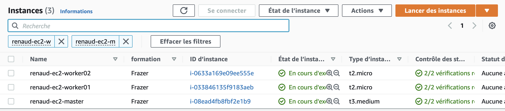

# Ansible

### Table des matières
I. [Installation](#install)<br />
&nbsp;&nbsp;&nbsp;A. [Création de 3 machines cloud ec2](#ec2)<br />
&nbsp;&nbsp;&nbsp;B. [Installation ansible](#ansible)<br />
II. [Manifest](#manifest)<br />
&nbsp;&nbsp;&nbsp;A. [Gestion de l'inventaire](#manifest)<br />
&nbsp;&nbsp;&nbsp;B. [Module Copy](#copy)<br />
&nbsp;&nbsp;&nbsp;C. [Module Package](#package)<br />
&nbsp;&nbsp;&nbsp;D. [Inventaire au format yaml](#yaml)<br />
&nbsp;&nbsp;&nbsp;E. [Module setup](#setup)<br />
&nbsp;&nbsp;&nbsp;F. [Inventaire et variables](#variable)<br />
III. [Playbook](#playbook)<br />
&nbsp;&nbsp;&nbsp;A. [Utilisation du playbook](#useplaybook)<br />
&nbsp;&nbsp;&nbsp;B. [Templating Jinja](#jinja)<br />
&nbsp;&nbsp;&nbsp;C. [When et loop](#when)<br />
&nbsp;&nbsp;&nbsp;D. [Include et Import](#include)<br />


## I- Installation <a name="install"></a>

### A – Création d’une machine cloud ec2 (renaud-ec2-prod) <a name="ec2"></a>


3 machines AWS

* Ubuntu (renaud-ec2-master, renaud-ec2-worker01, renaud-ec2-worker02)
* EC2 : t3.medium, t2.micro (x2)
* 8 Go
* renaud-sg-ansible : 22
* master: 3.231.223.229 , worker01: 3.91.213.82 , worker02: 3.88.215.129


### B – Installation ansible <a name="ansible"></a>

* Utilisation de utilitaire pip

```sh
python3 --version
sudo apt-get -y update
sudo apt-get -y install python3-pip
sudo pip3 install ansible

ansible --version
------------
ansible [core 2.12.1]
  config file = None
  configured module search path = ['/home/ubuntu/.ansible/plugins/modules', '/usr/share/ansible/plugins/modules']
  ansible python module location = /usr/local/lib/python3.8/dist-packages/ansible
  ansible collection location = /home/ubuntu/.ansible/collections:/usr/share/ansible/collections
  executable location = /usr/local/bin/ansible
  python version = 3.8.10 (default, Nov 26 2021, 20:14:08) [GCC 9.3.0]
  jinja version = 2.10.1
  libyaml = True
------------
```
<br />

* Utilisation du gestionnaire de packets

```sh
#!/bin/bash
sudo apt-get update
sudo apt-get install ansible
sudo yum install ansible
```


## II- Manifest <a name="manifest"></a>

### A – Gestion de l'inventaire <a name="manifest"></a>

* IP privées
master: 172.31.6.38
worker01: 172.31.82.253
worker02: 172.31.93.193

```sh
sudo apt-get install sshpass -y

vi hosts
```
**hosts:**
```sh
172.31.82.253 ansible_user=ubuntu ansible_password=ubuntu ansible_ssh_common_args='-o StrictHostKeyChecking=no'
```
<br />

```sh
ansible -i hosts all -m ping
------------
172.31.82.253 | FAILED! => {
    "msg": "to use the 'ssh' connection type with passwords or pkcs11_provider, you must install the sshpass program"
}
------------
sudo apt-get -y install sshpass
ansible -i hosts all -m ping
------------
172.31.82.253 | UNREACHABLE! => {
    "changed": false,
    "msg": "Failed to connect to the host via ssh: Warning: Permanently added '172.31.82.253' (ECDSA) to the list of known hosts.\r\nubuntu@172.31.82.253: Permission denied (publickey).",
    "unreachable": true
}
------------
```

* On doit activativer de l'authentification par password sur les clients

```sh
sudo vi /etc/ssh/sshd_config      =>  PasswordAuthentication yes
sudo systemctl restart ssh
sudo -i
passwd ubuntu

ansible -i hosts all -m ping
------------
172.31.82.253 | SUCCESS => {
    "ansible_facts": {
        "discovered_interpreter_python": "/usr/bin/python3"
    },
    "changed": false,
    "ping": "pong"
------------
```

* Modification du hosts

```sh
vi hosts
```
**hosts:**
```sh
worker01 ansible_host=172.31.82.253 ansible_user=ubuntu ansible_password=ubuntu ansible_ssh_common_args='-o StrictHostKeyChecking=no'
```
<br />

```sh
ansible -i hosts all -m ping
------------
worker01 | SUCCESS => {
    "ansible_facts": {
        "discovered_interpreter_python": "/usr/bin/python3"
    },
    "changed": false,
    "ping": "pong"
}
------------
```

### B – Module Copy <a name="copy"></a>

```sh
ansible -i hosts all -m copy -a "dest=/home/ubuntu/renaud.txt content='Bonjour Renaud'"
```

### C – Module Package <a name="package"></a>

********
TP3
********

* Inventaire

```sh
vi hosts
```
**hosts:**
```sh
worker01 ansible_host=172.31.82.253 ansible_user=ubuntu ansible_password=ubuntu ansible_ssh_common_args='-o StrictHostKeyChecking=no'
worker02 ansible_host=172.31.93.193 ansible_user=ubuntu ansible_password=ubuntu ansible_ssh_common_args='-o StrictHostKeyChecking=no'
```
<br />

```sh
ansible -i hosts all -m ping
------------
worker01 | SUCCESS => {
    "ansible_facts": {
        "discovered_interpreter_python": "/usr/bin/python3"
    },
    "changed": false,
    "ping": "pong"
}
worker02 | SUCCESS => {
    "ansible_facts": {
        "discovered_interpreter_python": "/usr/bin/python3"
    },
    "changed": false,
    "ping": "pong"
}
------------
```

* Installation

```sh
ansible -i hosts -b -m package -a "name=nginx state=present" worker01
ansible -i hosts -b -m service -a "name=nginx state=started enabled=yes" worker01

ansible -i hosts -b -m package -a "name=apache2 state=present" worker02
ansible -i hosts -b -m service -a "name=apache2 state=started enabled=yes" worker02
```

On ouvre le port 80 du security Group


* Désinstallation

```sh
ansible -i hosts -b -m package -a "name=nginx state=absent purge=yes autoremove=yes" worker01

ansible -i hosts -b -m package -a "name=apache2 state=absent purge=yes autoremove=yes" worker02
```

Vérification que le service ne tourne plus:
```sh
#worker01
ps -ef | grep nginx
#worker02
ps -ef | grep apache2
```

### D – Inventaire au format yaml <a name="yaml"></a>

****
TP 4
****
```sh
vi hosts.yaml
```
**hosts.yaml:**
```yaml
all:
  hosts:
    worker01:
      ansible_host: 172.31.82.253
      ansible_user: ubuntu
      ansible_password: ubuntu
      ansible_ssh_common_args: '-o StrictHostKeyChecking=no'

    worker02: 
      ansible_host: 172.31.93.193
      ansible_user: ubuntu
      ansible_password: ubuntu
      ansible_ssh_common_args: '-o StrictHostKeyChecking=no'
```
<br />

```sh
ansible -i hosts.yaml -m ping all
```

### E – Module Setup <a name="setup"></a>

****
TP 5
****

```sh
ansible -i hosts.yaml all -m setup 
ansible -i hosts.yaml all -m setup | grep -i hostname
ansible -i hosts.yaml all -m setup | grep ansible_distribution
```

```sh
#Récupérartion des variables de nos environnement
ansible-inventory -i hosts.yaml --list
ansible-inventory -i hosts.yaml --host worker01
#Format yaml
ansible-inventory -i hosts.yaml --host worker01 -y
```
<br />

### F – Inventaire et variables <a name="variable"></a>

****
TP 6
****

```sh
vi hosts.ini
```
**hosts.ini:**
```ini
[all:vars]
ansible_user=ubuntu
ansible_ssh_common_args='-o StrictHostKeyChecking=no'

[ansible]
localhost ansible_connection=local

[prod]
worker01 ansible_host=172.31.82.253 ansible_password=ubuntu
worker02 ansible_host=172.31.93.193 ansible_password=ubuntu

[prod:vars]
env=prod
```
<br />

```sh
#Format yaml
ansible-inventory -i hosts.ini --list -y > hosts.yaml
#Format json
ansible-inventory -i hosts.ini --list > hosts.json
#test
ansible -i hosts.ini -m ping all
ansible -i hosts.yaml -m ping all
ansible -i hosts.json -m ping all
```
<br />

```sh
vi host.yaml
```
**host.yaml**
```yaml
all:
  children:
    ansible:
      hosts:
        localhost:
          ansible_connection: local
          ansible_ssh_common_args: -o StrictHostKeyChecking=no
          ansible_user: ubuntu
    prod:
      hosts:
        worker01:
          ansible_host: 172.31.82.253
          ansible_password: ubuntu
          ansible_ssh_common_args: -o StrictHostKeyChecking=no
          ansible_user: ubuntu
          env: prod
        worker02:
          ansible_host: 172.31.93.193
          ansible_password: ubuntu
          ansible_ssh_common_args: -o StrictHostKeyChecking=no
          ansible_user: ubuntu
          env: prod
    ungrouped: {}
```


****
TP 7 (surcharge)
****

```sh
ansible -i hosts.yaml all -m debug -a "msg={{  env }} "
------------
localhost | FAILED! => {
    "msg": "The task includes an option with an undefined variable. The error was: 'env' is undefined. 'env' is undefined"
}
worker01 | SUCCESS => {
    "msg": "prod"
}
worker02 | SUCCESS => {
    "msg": "prod"
}
------------
```

<br/>

* Surcharge avec group_vars

```sh
mkdir group_vars
vi group_vars/prod.yaml        =>   env: test_prod

ansible -i hosts.ini all -m debug -a "msg={{  env }} "
------------
localhost | FAILED! => {
    "msg": "The task includes an option with an undefined variable. The error was: 'env' is undefined. 'env' is undefined"
}
worker02 | SUCCESS => {
    "msg": "test_prod"
}
worker01 | SUCCESS => {
    "msg": "test_prod"
}
------------
```
<br />

* Surcharge avec host_vars

```sh
mkdir host_vars

vi host_vars/worker01.yaml      =>   env: test_prod_W1

ansible -i hosts.ini all -m debug -a "msg={{  env }} "
------------
localhost | FAILED! => {
    "msg": "The task includes an option with an undefined variable. The error was: 'env' is undefined. 'env' is undefined"
}
worker01 | SUCCESS => {
    "msg": "test_prod_W1"
}
worker02 | SUCCESS => {
    "msg": "test_prod"
}
------------
```

```sh
vi host_vars/localhost.yaml         =>   env: test_prod_local

ansible -i hosts.ini all -m debug -a "msg={{  env }} "
------------
localhost | SUCCESS => {
    "msg": "test_prod_local"
}
worker01 | SUCCESS => {
    "msg": "test_prod_W1"
}
worker02 | SUCCESS => {
    "msg": "test_prod"
}
------------
```
<br />

* Surcharger en utilisant le parameter –e
```sh
ansible -i hosts.ini all -m debug -a "msg={{  env }} " -e env=surcharge
------------
localhost | SUCCESS => {
    "msg": "surcharge"
}
worker02 | SUCCESS => {
    "msg": "surcharge"
}
worker01 | SUCCESS => {
    "msg": "surcharge"
}
------------
```

## III- Playbook <a name="playbook"></a>

### A – Utilisation du playbook <a name="useplaybook"></a>
****
TP 8 (Déployez un serveur web)
****

```sh
#Install de l'outil de validation du playbook
sudo apt-get -y install ansible-lint

mkdir webapp
cd webapp/

vi prod.yaml
```
**prod.yaml**
```yaml
all:
  children:
    prod:
      vars:
        env: production
      hosts:
        worker01:
          ansible_host: 172.31.82.253
        worker02:
          ansible_host: 172.31.93.193
```

<br />

```sh
mkdir group_vars
vi group_vars/prod.yaml
```
**prod.yaml**
```yaml
env: prod
ansible_user: ubuntu
ansible_password: ubuntu
ansible_ssh_common_args: -o StrictHostKeyChecking=no
```
<br />

```sh
echo "Bonjour Renaud" > index.html

vi nginx.yaml
```
**nginx.yaml**
```yaml
- name: "install webserver"
  become: yes
  hosts: worker01
  pre_tasks:
    - name: "Test debug env var"
      debug:
        msg: "{{ env }}"
  tasks:
    - name: "install nginx"
      package:
        name: nginx
        state: present
    - name: "start nginx"
      service:
        name: nginx
        state: started
        enabled: yes
    - name: "copy file"
      copy:
        src: "index.html"
        dest: "/var/www/html"
```
<br />

```sh
ansible-playbook -i prod.yaml nginx.yaml

ansible-lint nginx.yaml
```
<br />

* Désinstallation du webserver

```sh
vi unnginx.yaml
```
**unnginx.yaml**
```yaml
- name: "uninstall webserver"
  become: yes
  hosts: prod
  tasks:
    - name: "Test debug env var"
      debug:
        msg: "{{ env }}"
    - name: "uninstall nginx"
      package: 
        name: nginx
        state: absent
        purge: yes
        autoremove: yes
```

### B – Templating Jinja <a name="jinja"></a>
****
TP 9 (Jinja) 
****

```sh
mkdir jinja
cd jinja

mkdir group_vars
vi group_vars/prod.yaml
```
**prod.yaml**
```yaml
env: prod
ansible_user: ubuntu
ansible_password: ubuntu
ansible_ssh_common_args: -o StrictHostKeyChecking=no
```
<br />

```sh
vi hosts.yaml
```
**hosts.yaml**
```yaml
all:
  children:
    prod:
      vars:
        env: production
      hosts:
        worker01:
          ansible_host: 172.31.82.253
        worker02:
          ansible_host: 172.31.93.193
```

<br />

```sh
mkdir template

vi template/install_nginx.sh.j2
```
**install_nginx.sh.j2**
```sh
#!/bin/bash

apt-get -y install {{ app }}

yum -y install {{ app }}


systemctl start {{ app }}
systemctl enable {{ app }}
```
<br />

```sh
vi nginx.yaml
```
**nginx.yaml**
```yaml
- name: "install webserver"
  become: yes
  vars:
    app: nginx
  hosts: prod
  pre_tasks:
    - name: "Test debug env var"
      debug:
        msg: "{{ env }}"
  tasks:
    - name: "Generate install_nginx"
      template:
        src: "./template/install_nginx.sh.j2"
        dest: "/home/{{ ansible_user }}/install_nginx.sh"
    - name: "Execute install_nginx"
      command:
        cmd: "sh /home/{{ ansible_user }}/install_nginx.sh"
```
```sh
ansible-playbook -i hosts.yaml nginx.yaml 
```
<br />

****
TP 10 (Jinja) 
****
* On créer le fichier uninstall_nginx.sh.j2
```sh
vi template/uninstall_nginx.sh.j2
```
**uninstall_nginx.sh.j2**
```sh
#!/bin/bash

apt-get -y purge --autoremove {{ app }}

yum -y purge --autoremove {{ app }}


```
<br />

* On créer le fichier unnginx.yaml

```sh
vi unnginx.yaml
```
**unnginx.yaml**
```yaml
- name: "uninstall webserver"
  become: yes
  vars:
    app: nginx
  hosts: worker02
  pre_tasks:
    - name: "Test debug env var"
      debug:
        msg: "{{ env }}"
  tasks:
    - name: "Generate uninstall_nginx"
      template:
        src: "./template/uninstall_nginx.sh.j2"
        dest: "/home/{{ ansible_user }}/uninstall_nginx.sh"
    - name: "Execute uninstall_nginx"
      command:
        cmd: "sh /home/{{ ansible_user }}/uninstall_nginx.sh"
```
```sh
ansible-playbook -i hosts.yaml unnginx.yaml 
```
<br />

****
TP 11 (Jinja) 
****

* Modification manuellement des noms de vos serveurs
```sh
sudo vi /etc/hosts
```
**hosts**
```sh
172.31.6.38 AnsibleMaster
172.31.82.253 AnsibleWorker01
172.31.93.193 AnsibleWorker02
```

vi /template/install_app.sh.j2
**install_app.sh.j2**
```sh
#!/bin/bash

apt-get -y install {{ app }}

yum -y install {{ app }}


```

```sh
vi webapp.yaml
```
**webapp.yaml**
```yaml
- name: "install webserver"
  become: yes
  vars:
    app: nginx
  hosts: prod
  pre_tasks:
    - name: "Test debug env var"
      debug:
        msg: "{{ env }}"
  tasks:
    - name: "Generate install_nginx"
      template:
        src: "./template/install_app.sh.j2"
        dest: "/home/{{ ansible_user }}/install_{{ app }}.sh"
    - name: "Execute install_nginx"
      command:
        cmd: "sh /home/{{ ansible_user }}/install_{{ app }}.sh"
    - name: "delete directory"
      file:
        path: "/var/www/html"
        state: absent
    - name: "create directory"
      file:
        path: "/var/www/html"
        state: directory
    - name: "Git clone"
      git:
        repo: 'https://github.com/diranetafen/static-website-example.git'
        dest: '/var/www/html'
    - name: "sed index.html"
      command:
        cmd: "sed -i 's/Dimension/Dimension : {{ ansible_hostname }}/' /var/www/html/index.html"
```
<br />


### C – When et loop <a name="when"></a>

****
TP 12 (When et loop) 
****
```sh
vi install.yaml
```

<details>
<summary>**install.yaml**</summary>

```yaml
- name: "install app"
  become: yes
  hosts: prod
  pre_tasks:
    - name: "Test debug env var"
      debug:
        msg: "{{ env }}"
  tasks:
    - name: "install app"
      apt:
        name: "{{ item }}"
        state: present
      when: ansible_distribution == "Ubuntu"
      loop:
        - nginx
        - git
```
</details>


### D – Include et Import <a name="include"></a>


