# Mini Projet JENKINS - Static Website
## I- Installation
### A – Création d’une machine cloud ec2 (renaud-ec2-prod)
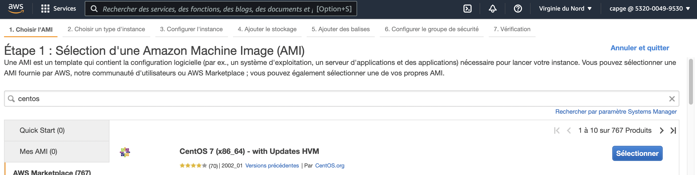
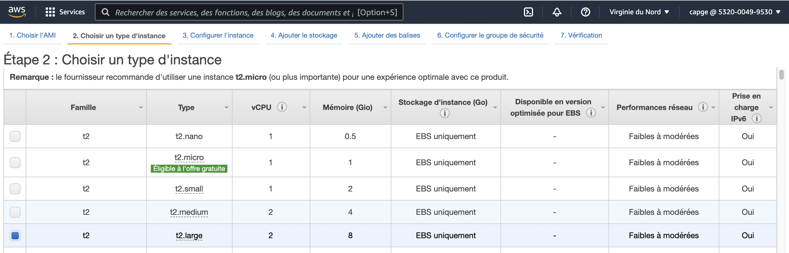
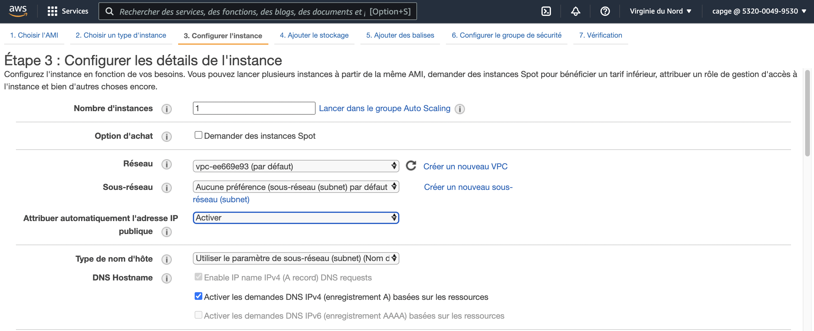
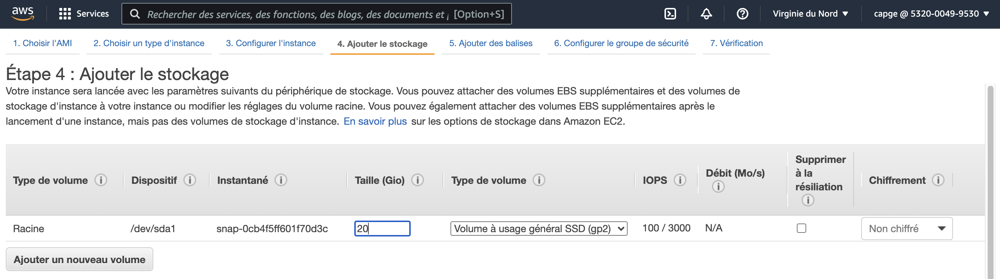
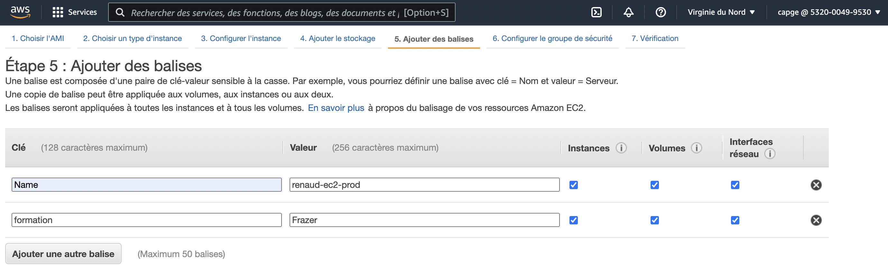
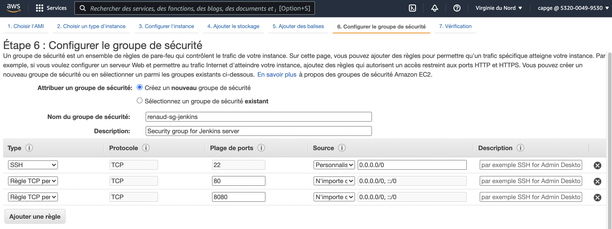
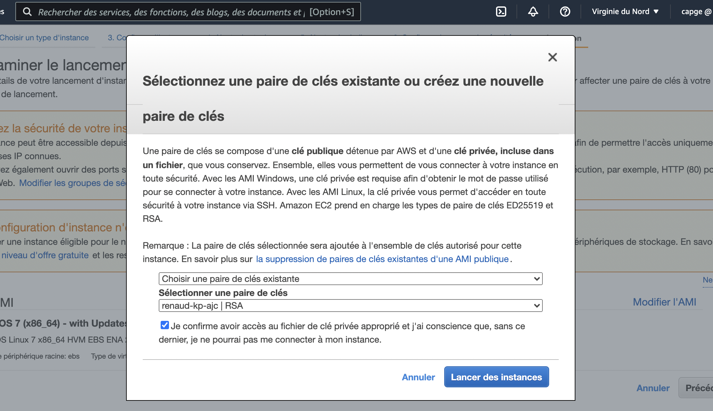
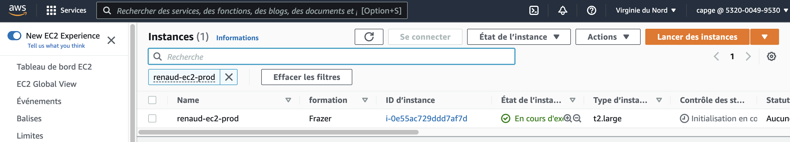

### B- Installation de Jenkins et dépendances

* Update :
```sh
#UPDATE
yum -y update
```

* Java :
```sh
#JAVA INSTALL
yum -y install java-1.8.0-openjdk
yum -y install wget
```

* Jenkins :
```sh
#JENKINS INSTALL
wget -O /etc/yum.repos.d/jenkins.repo https://pkg.jenkins.io/redhat-stable/jenkins.repo
rpm --import https://pkg.jenkins.io/redhat-stable/jenkins.io.key
sudo yum install epel-release -y 
sudo yum-config-manager --enable epel
sudo yum install daemonize -y
yum -y install jenkins
systemctl start jenkins
```

Récupération du mot de passe Administrateur
```sh
cat /var/lib/jenkins/secrets/initialAdminPassword
```
e021151a8f8646a4bbcea906ce1b470b

* Selinux :

On désactive selinux (enforcing -> disable)
```sh
vi /etc/selinux/config
```

* Nginx :
```sh
#NGINX INSTALL
yum -y install nginx
```

Création du fichier de configuration pour rediriger vers Jenkins
```sh
vi /etc/nginx/conf.d/jenkins.conf
```
```sh
upstream jenkins{
    server 127.0.0.1:8080;
}

server{
    listen      80;
    server_name 54.146.251.134;

    access_log  /var/log/nginx/jenkins.access.log;
    error_log   /var/log/nginx/jenkins.error.log;

    proxy_buffers 16 64k;
    proxy_buffer_size 128k;

    location / {
        proxy_pass  http://jenkins;
        proxy_next_upstream error timeout invalid_header http_500 http_502 http_503 http_504;
        proxy_redirect off;

        proxy_set_header    Host            $host;
        proxy_set_header    X-Real-IP       $remote_addr;
        proxy_set_header    X-Forwarded-For $proxy_add_x_forwarded_for;
        proxy_set_header    X-Forwarded-Proto https;
    }

}
```

Démarrage du service Nginx:
```sh
systemctl start nginx
systemctl enable nginx
```

* Démarrage de Jenkins :

http://54.146.251.134:8080/

<br />

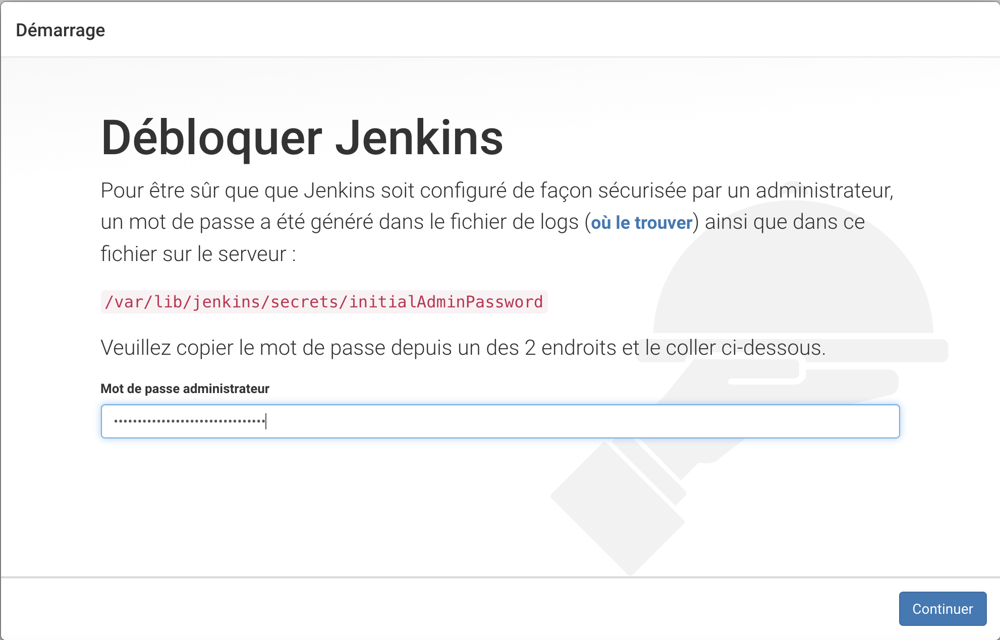
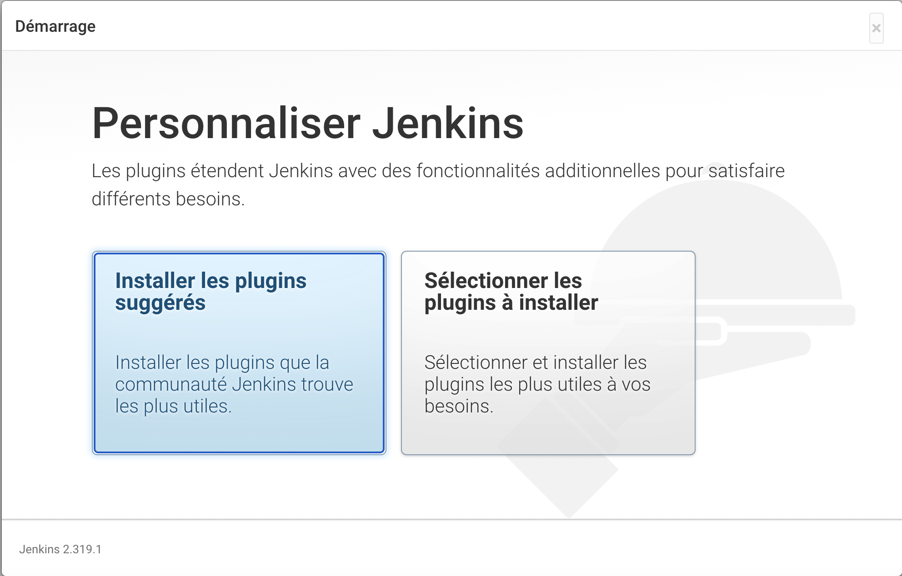
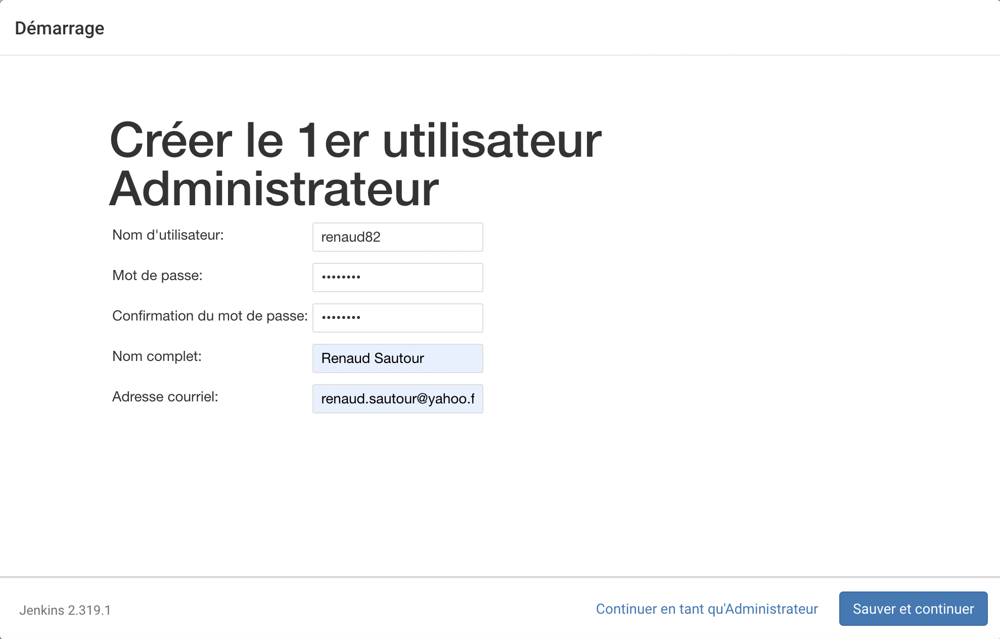
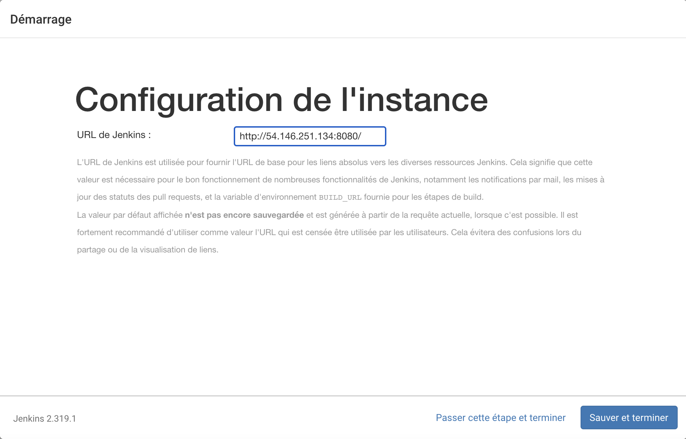

* Docker et Docker compose :
```sh
#Install docker
curl -fsSL https://get.docker.com -o get-docker.sh
sh get-docker.sh
sudo usermod -aG docker centos
systemctl start docker
```
```sh
#Install Docker compose
sudo curl -L "https://github.com/docker/compose/releases/download/1.29.2/docker-compose-$(uname -s)-$(uname -m)" -o /usr/local/bin/docker-compose
sudo chmod +x /usr/local/bin/docker-compose
```

* Git 
```sh
#Install Git
yum -y install git
```

Projet basé sur le repository Git :
https://github.com/diranetafen/static-website-example.git


## II- Build Image (Docker)

Créer un fichier Dockerfile permettant de conteneuriser l’application static-website :
```sh
FROM ubuntu
LABEL maintainer='Renaud Sautour'
RUN apt-get update
RUN apt-get install -y nginx
COPY ./static-website/ /var/www/html/
EXPOSE 80
ENTRYPOINT ["/usr/sbin/nginx", "-g", "daemon off;"]
```

## III- Pipeline
### A – Création des crédential

* dockerHub (dockerhub_password) :
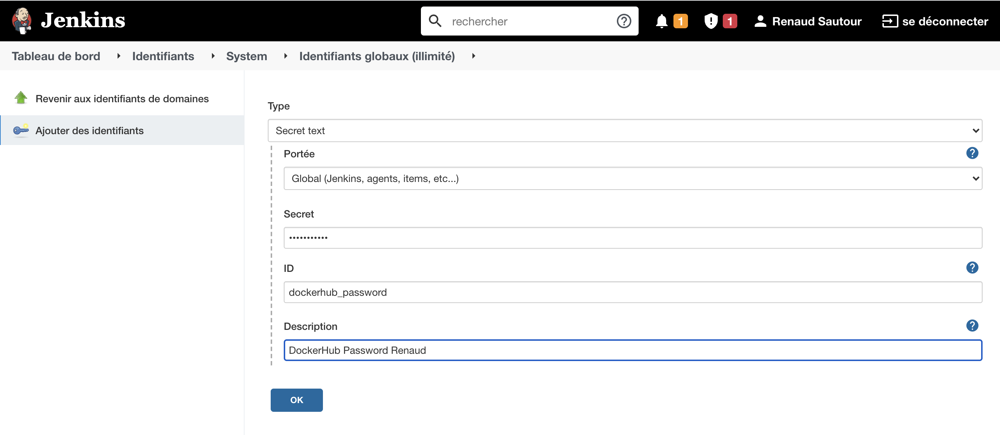

* key ssh production environment (ec2_prod_private_key)
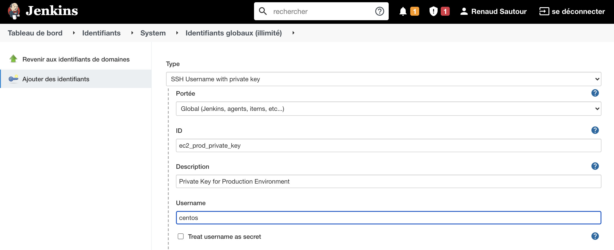
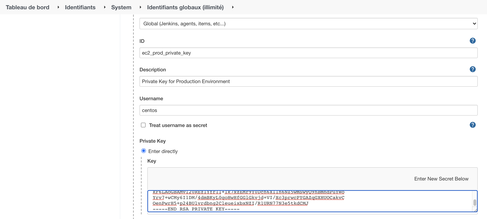
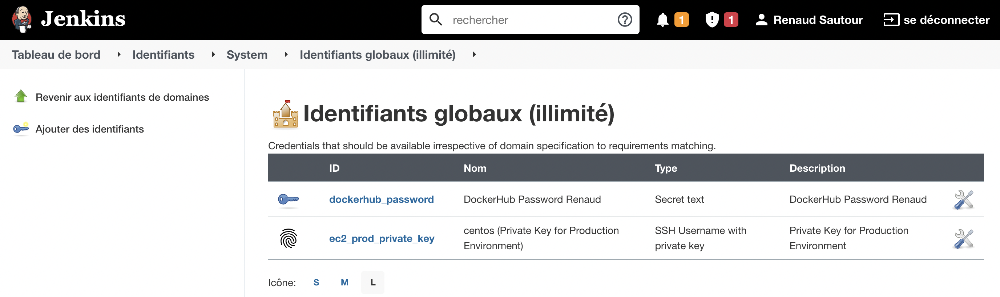
 
### B – Création du pipeline

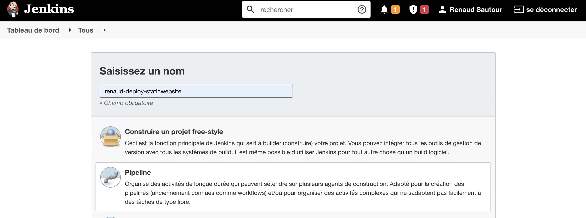

* Création de la variable de TAG :
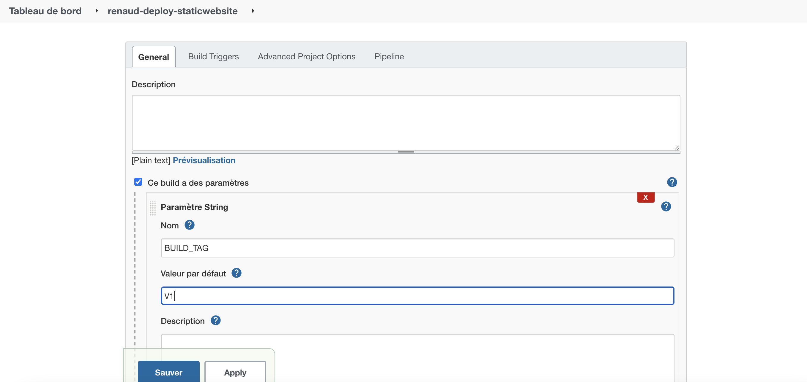 

* Repository GIT :
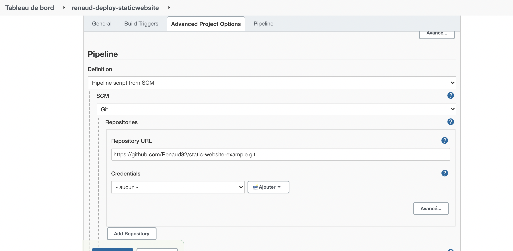 

* Ouverture des port 5000 (staging) et 5001 (production) sur le groupe de sécurité aws
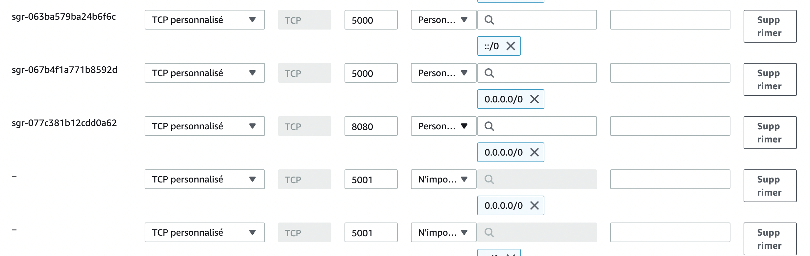

* Jenkinsfile
```sh
pipeline {

    environment {
        IMAGE_NAME = "satic-website"
        USERNAME = "renaud82"
        CONTAINER_NAME = "saticwebsite"
        EC2_STAGING_HOST = "54.146.251.134"
        EC2_PRODUCTION_HOST = "54.146.251.134"
    }

    agent none

    stages{

       stage ('Build Image'){
           agent any
           steps {
               script{
                   sh 'docker build -t $USERNAME/$IMAGE_NAME:$BUILD_TAG .'
               }
           }
       }

       stage ('Run test container') {
           agent any
           steps {
               script{
                   sh '''
                       docker stop $CONTAINER_NAME || true
                       docker rm $CONTAINER_NAME || true
                       docker run --name $CONTAINER_NAME -d -p 5000:80 $USERNAME/$IMAGE_NAME:$BUILD_TAG
                       sleep 10
                   '''
               }
           }
       }

       stage ('Test container') {
           agent any
           steps {
               script{
                   sh '''
                       curl http://localhost:5000 | grep -iq "Welcome"
                   '''
               }
           }
       }

       stage ('clean env and save artifact') {
           agent any
           environment{
               PASSWORD = credentials('dockerhub_password')
           }
           steps {
               script{
                   sh '''
                       docker login -u $USERNAME -p $PASSWORD
                       docker push $USERNAME/$IMAGE_NAME:$BUILD_TAG
                       docker stop $CONTAINER_NAME || true
                       docker rm $CONTAINER_NAME || true
                       docker rmi $USERNAME/$IMAGE_NAME:$BUILD_TAG
                   '''
               }
           }
       }

         stage('Deploy app on EC2-cloud Staging') {
            agent any
            when{
                expression{ GIT_BRANCH == 'origin/master'}
            }
            steps{
                withCredentials([sshUserPrivateKey(credentialsId: "ec2_prod_private_key", keyFileVariable: 'keyfile', usernameVariable: 'NUSER')]) {
                    catchError(buildResult: 'SUCCESS', stageResult: 'FAILURE') {
                        script{ 
                            sh'''
                                ssh -o StrictHostKeyChecking=no -i ${keyfile} ${NUSER}@${EC2_STAGING_HOST} docker stop $CONTAINER_NAME || true
                                ssh -o StrictHostKeyChecking=no -i ${keyfile} ${NUSER}@${EC2_STAGING_HOST} docker rm $CONTAINER_NAME || true
                                ssh -o StrictHostKeyChecking=no -i ${keyfile} ${NUSER}@${EC2_STAGING_HOST} docker run --name $CONTAINER_NAME -d -p 5000:80 $USERNAME/$IMAGE_NAME:$BUILD_TAG
                            '''
                        }
                    }
                }
            } 
        }

        stage('Deploy app on EC2-cloud Production') {
            agent any
            when{
                expression{ GIT_BRANCH == 'origin/master'}
            }
            steps{
                withCredentials([sshUserPrivateKey(credentialsId: "ec2_prod_private_key", keyFileVariable: 'keyfile', usernameVariable: 'NUSER')]) {
                    catchError(buildResult: 'SUCCESS', stageResult: 'FAILURE') {
                        script{ 
                            timeout(time: 15, unit: "MINUTES") {
                                input message: 'Do you want to approve the deploy in production?', ok: 'Yes'
                            }

                            sh'''
                                ssh -o StrictHostKeyChecking=no -i ${keyfile} ${NUSER}@${EC2_PRODUCTION_HOST} docker stop $CONTAINER_NAME || true
                                ssh -o StrictHostKeyChecking=no -i ${keyfile} ${NUSER}@${EC2_PRODUCTION_HOST} docker rm $CONTAINER_NAME || true
                                ssh -o StrictHostKeyChecking=no -i ${keyfile} ${NUSER}@${EC2_PRODUCTION_HOST} docker run --name $CONTAINER_NAME -d -p 5001:80 $USERNAME/$IMAGE_NAME:$BUILD_TAG
                            '''
                        }
                    }
                }
            } 
        }
    }
}
```

### C – Lancement du pipeline

* En attente de validation pour la production :
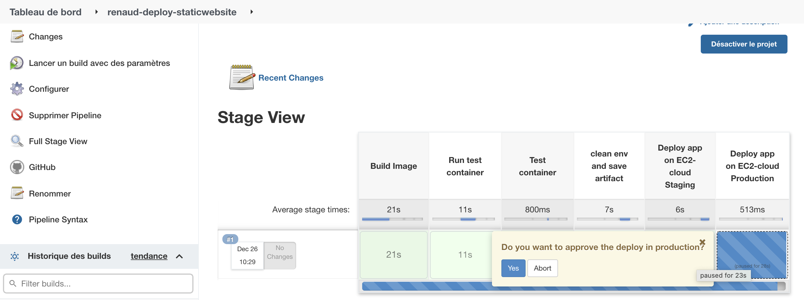

* Vérification du repository DockerHub :
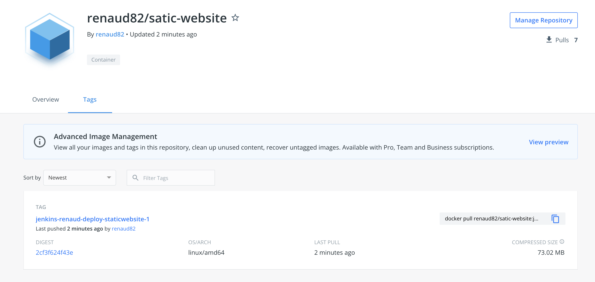

•	Vérification de l’environnement de Staging
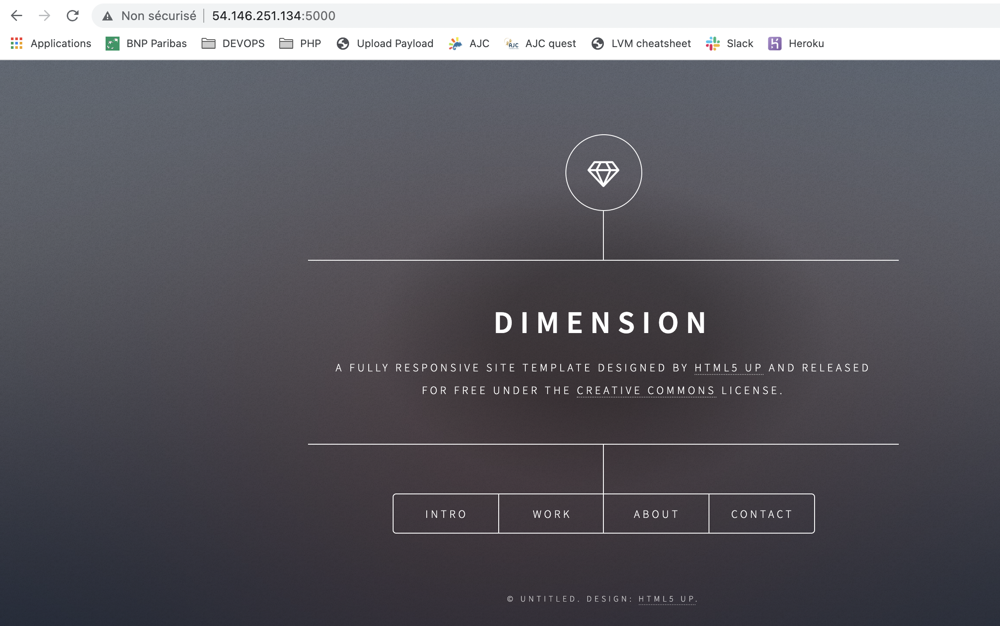
 
•	Après validation on vérifie en environnement de production
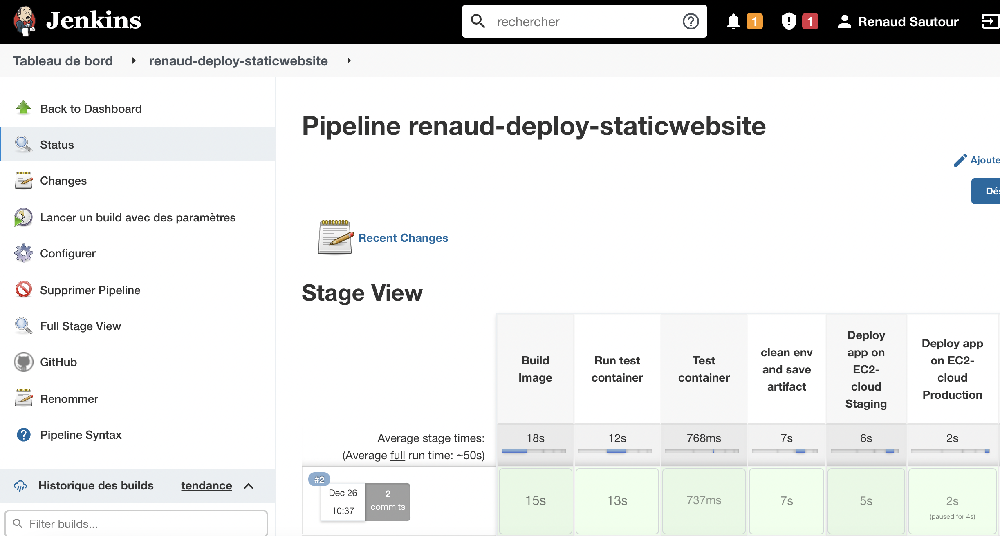
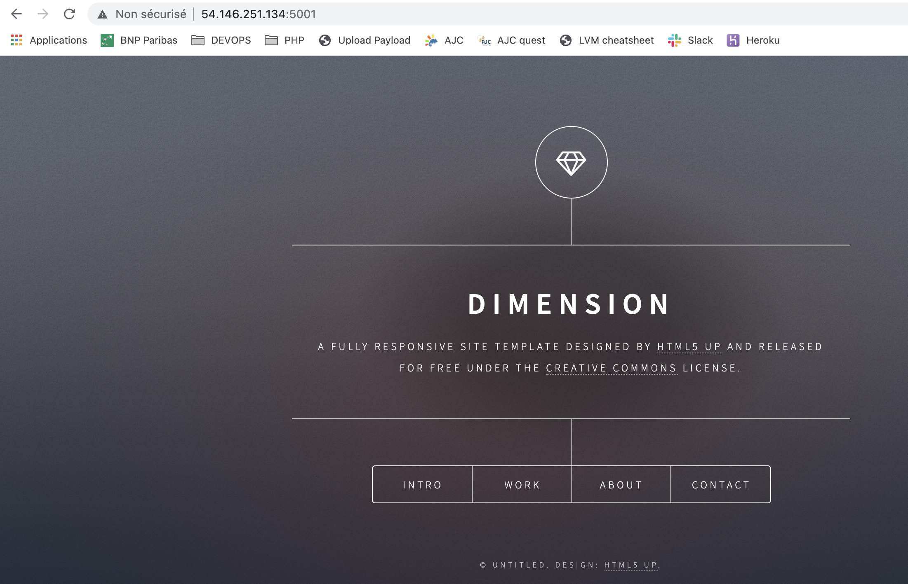
 

## IV- Ajout de plugin au Pipeline

### A – Trigger GitHub

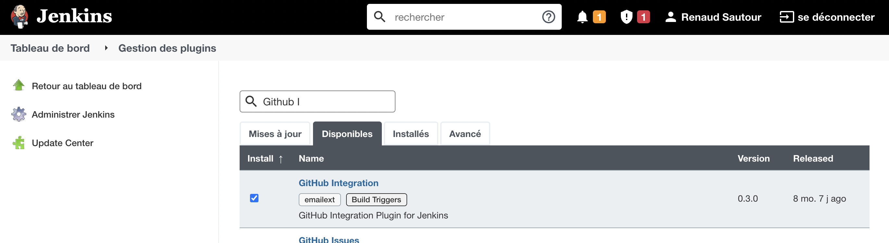
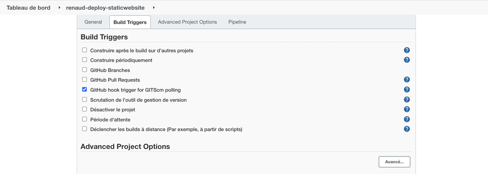

* Configuration du webhook sur GitHub
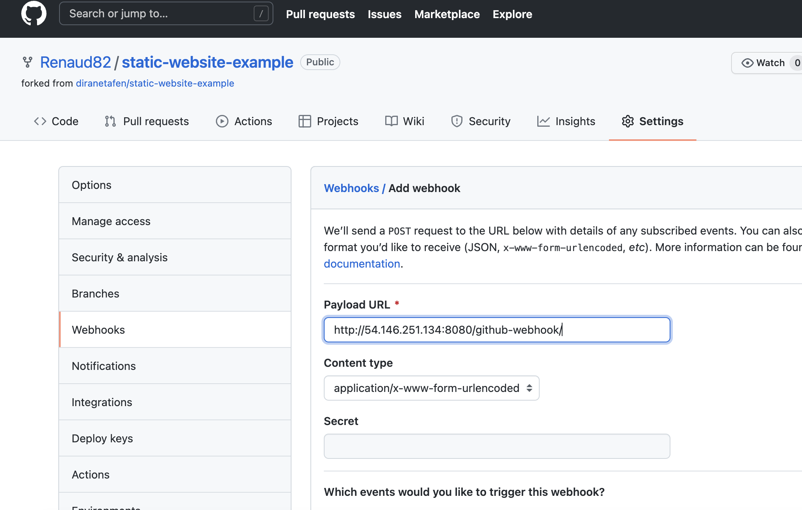
 

### B – Embeddable Build Status

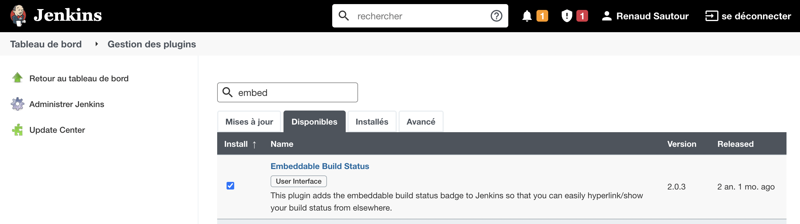

* On récupère le lien Markdown
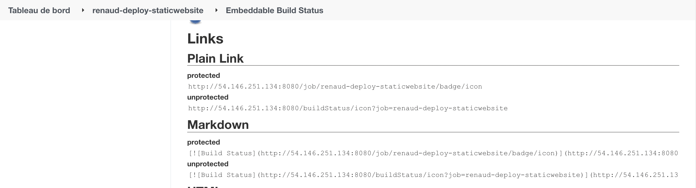

* On rajoute le lien dans le fichier README.md
```sh
[](http://54.146.251.134:8080/job/renaud-deploy-staticwebsite/)
```

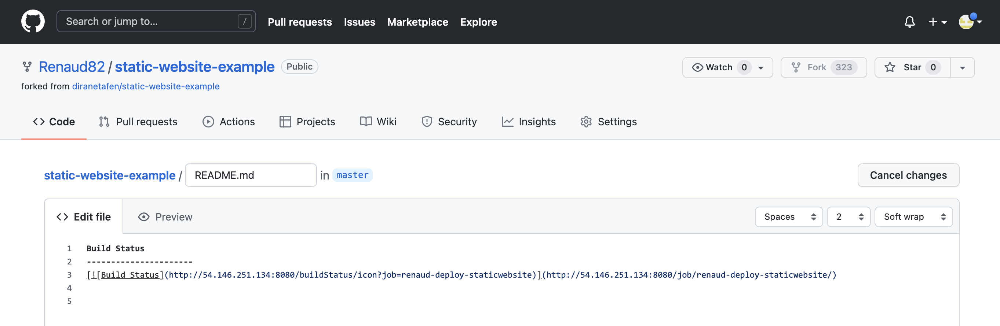
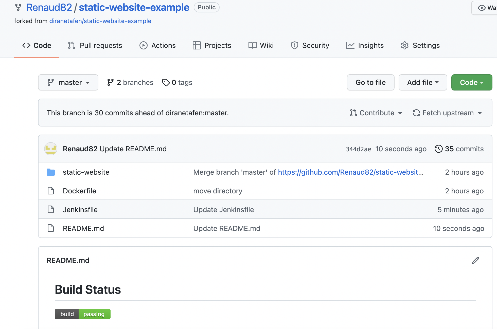

<br />

### C – Slack notification
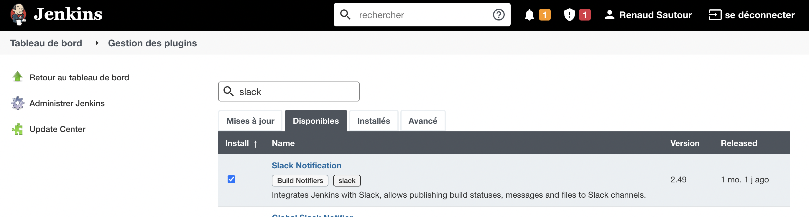
 

* Création du canal (ynov-project-jenkins)
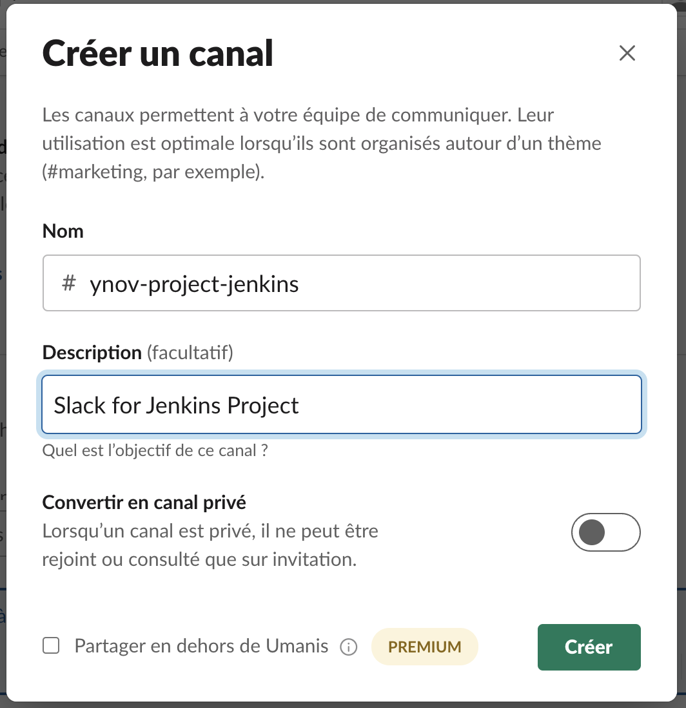
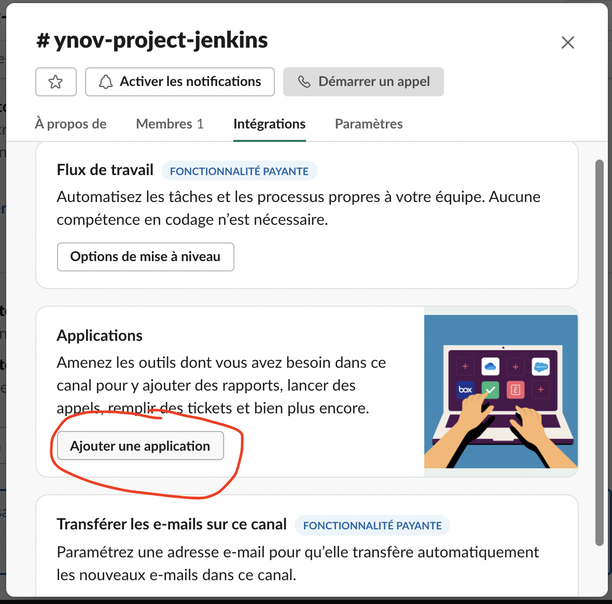
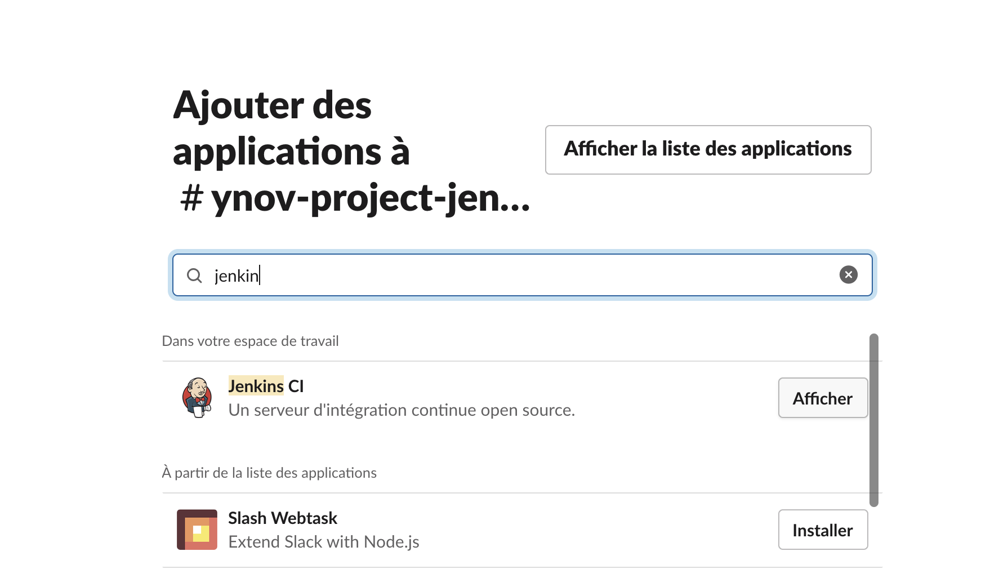
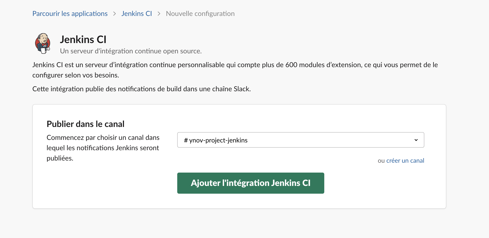
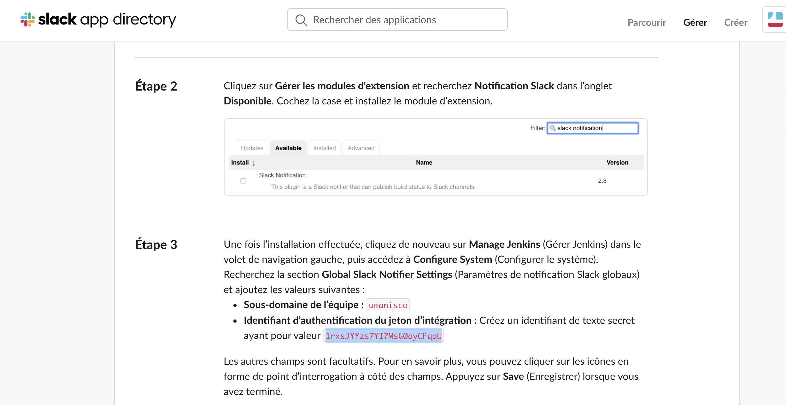
 	 
* Création credential secret text
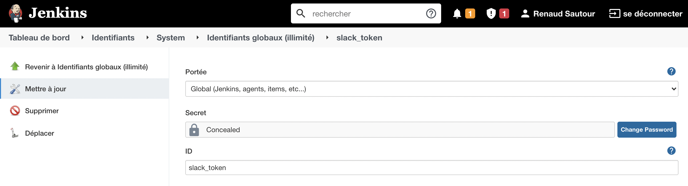

* Configuration de Slack dans Jenkins
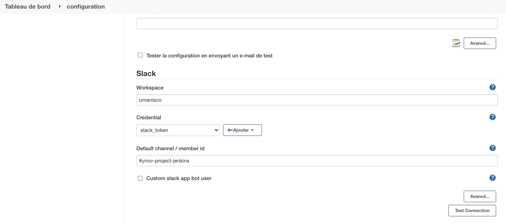
 
* Ajout des lignes de commande dans Jenkinsfile pour la notification Slack
```sh
    post {
        success{
            slackSend (color: '#00FF00', message: "SUCCESSFUL: Job '${env.JOB_NAME} [${env.BUILD_NUMBER}]' (${env.BUILD_URL})")
        }
        failure {
            slackSend (color: '#FF0000', message: "FAILED: Job '${env.JOB_NAME} [${env.BUILD_NUMBER}]' (${env.BUILD_URL})")
        }
    }
```
<br />

### D – TEST du pipeline


•	Modification du fichier Index.html

 


•	Déclenchement automatique du pipeline

 

 

•	Vérification en environnement de Staging :

 


•	On valide la livraison en production :


 
 


 


•	Vérification de la notification Slack

 


