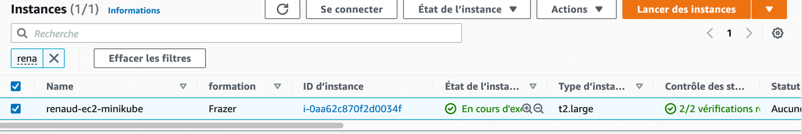

# Mini-Projet - Déployez Wordpress à l’aide de manifests

<br />

## I-	Création de l’instance sur AWS

<br />


<br />


<br />


<br />

```sh
#!/bin/bash
sudo hostnamectl set-hostname minikube-master
echo "127.0.0.1 minikube-master" >> /etc/hosts
sudo apt-get -y update
sudo apt install -y qemu qemu-kvm libvirt-daemon libvirt-clients bridge-utils virt-manager
sudo apt-get install -y socat
sudo apt-get install -y conntrack
sudo curl -fsSL https://get.docker.com -o get-docker.sh
sudo sh get-docker.sh
sudo usermod -aG docker ubuntu
systemctl start docker
sudo apt-get -y install wget
sudo wget https://storage.googleapis.com/minikube/releases/latest/minikube-linux-amd64
sudo chmod +x minikube-linux-amd64
sudo mv minikube-linux-amd64 /usr/bin/minikube
sudo curl -LO https://storage.googleapis.com/kubernetes-release/release/`curl -s https://storage.googleapis.com/kubernetes-release/release/stable.txt`/bin/linux/amd64/kubectl
sudo chmod +x kubectl
sudo mv kubectl  /usr/bin/
sudo echo '1' > /proc/sys/net/bridge/bridge-nf-call-iptables
sudo systemctl enable docker.service
```

<br />


<br />


<br />


<br />


<br />



<br />

## II-	Installation de minikube

<br />

```sh
minikube start --driver=none
```
<br />


<br />


<br />

* **On active l'autocomplétion kubernetes**
```sh
echo 'source <(kubectl completion bash)' >> ${HOME}/.bashrc
```

<br />

## III-	Création des manifest

<br />

* **Création du manifest de secret pour la connexion à mySQL**

```sh
vi secret.yaml
```
```yaml
apiVersion: v1
kind: Secret
metadata:
  name: mysql-secret
type: Opaque
data:
  mysql_user: cmVuYXVkCg==
  mysql_pwd: c2F1dG91cgo=
  mysql_root_pwd: cGFzc3dvcmQK
```

</br>

```sh
kubectl apply -f secret.yaml
```

</br>

* **Création du manifest de déploiement de mySQL**
```sh
vi deploy-mysql.yaml
```
```yaml
apiVersion: apps/v1
kind: Deployment
metadata:
  name: rsmysql
  labels:
    role: bdd
spec:
  replicas: 1
  selector: 
    matchLabels:
      app: mysql
  template:
    metadata:
      name: mysql
      labels:
        app: mysql
        type: pod
    spec:
      containers:
        - name: mysql
          image: mysql
          env:
            - name: MYSQL_USER 
              valueFrom:
                secretKeyRef:
                  name: mysql-secret
                  key: mysql_user
            - name: MYSQL_PASSWORD 
              valueFrom:
                secretKeyRef:
                  name: mysql-secret
                  key: mysql_pwd
            - name: MYSQL_DATABASE 
              value: easytraining
            - name: MYSQL_ROOT_PASSWORD 
              valueFrom:
                secretKeyRef:
                  name: mysql-secret
                  key: mysql_root_pwd
          ports:
            - containerPort: 3306
#lien du volume à utiliser pour cet hote  
          volumeMounts:
            - mountPath: /var/lib/mysql
              name: mysql-data
#creation du volume
      volumes: 
        - name: mysql-data
          hostPath:
            path: /db-data
            type: DirectoryOrCreate
```

